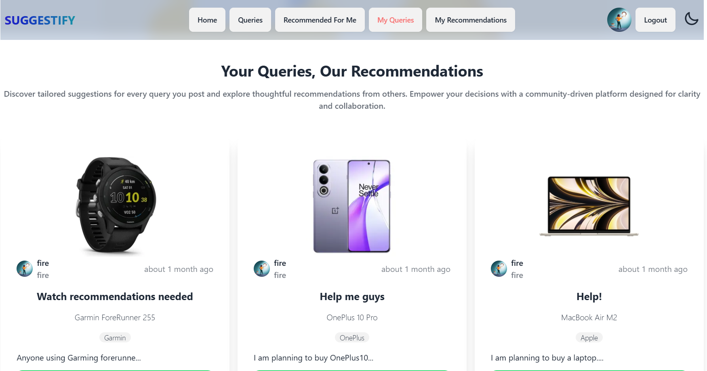

# SUGGESTIFY



# Live Link

- https://nafis-suggestify.netlify.app

## Purpose

In this website, users can register using their email and password, also they can use their google credentials for seamless login experience. Here users can query about any product, their likes and dislikes, users can suggest alternatives to a product too. Users can add a query, update and delete their queries. They can recommend a product and delete those recommendations too.

## Features

- Post inquiries about products
- Receive recommendations from other users
- View and manage your inquiries
- Comment on inquiries and recommendations
- User authentication using Firebase
- Interactive UI with animations

## Tech Stack

- **Frontend**: React, Tailwind CSS, DaisyUI, Swiper
- **Backend**: Firebase, Express, MongoDB
- **State Management**: React Hooks
- **Authentication**: Firebase Authentication
- **Other Libraries**: Axios, React Router, React Icons, React Toastify, SweetAlert2, Lottie React, React Fast Marquee

## Installation

1. Clone the repository:

   ```sh
   git clone https://github.com/NafisUlAlam/Suggestify.git
   cd Suggestify
   ```

2. Install dependencies:

   ```sh
   npm install
   ```

3. Create a `.env` file in the root directory and add the following:

# Front-End

```sh
VITE_apiKey=your_api_key
VITE_authDomain=your_auth_domain
VITE_projectId=your_project_id
VITE_storageBucket=your_storage_bucket
VITE_messagingSenderId=your_messaging_sender_id
VITE_appId=your_app_id
```

# Back-End

```sh
DB_USER=your_database_user
  DB_PASS=your_database_password
  JWT_SECRET=your_jwt_secret
```

4. Start the development server:
   ```sh
   npm run dev
   ```

## Dependencies

```json
"dependencies": {
    "@emotion/react": "^11.13.5",
    "axios": "^1.7.9",
    "date-fns": "^4.1.0",
    "firebase": "^11.0.2",
    "lottie-react": "^2.4.0",
    "prop-types": "^15.8.1",
    "react": "^18.3.1",
    "react-awesome-reveal": "^4.2.14",
    "react-dom": "^18.3.1",
    "react-fast-marquee": "^1.6.5",
    "react-icons": "^5.4.0",
    "react-responsive-carousel": "^3.2.23",
    "react-router-dom": "^6.28.0",
    "react-toastify": "^10.0.6",
    "sweetalert2": "^11.14.5",
    "swiper": "^11.1.15"
},
"devDependencies": {
    "@eslint/js": "^9.15.0",
    "@types/react": "^18.3.12",
    "@types/react-dom": "^18.3.1",
    "@vitejs/plugin-react": "^4.3.4",
    "autoprefixer": "^10.4.20",
    "daisyui": "^4.12.14",
    "eslint": "^9.15.0",
    "eslint-plugin-react": "^7.37.2",
    "eslint-plugin-react-hooks": "^5.0.0",
    "eslint-plugin-react-refresh": "^0.4.14",
    "globals": "^15.12.0",
    "postcss": "^8.4.49",
    "tailwindcss": "^3.4.15",
    "vite": "^6.0.1"
}
```

## Contributing

Contributions are welcome! Feel free to submit issues or pull requests.

## License

This project is licensed under the MIT License.
